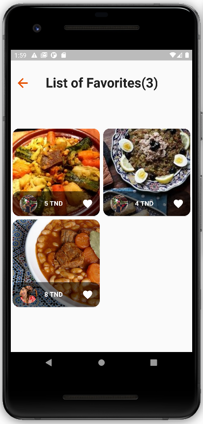
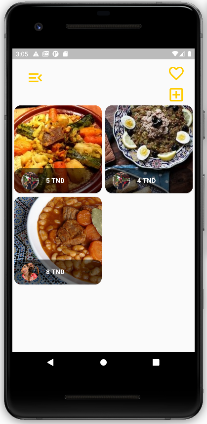

# :plate_with_cutlery: diari

Our mobile application is based on a customer-to-customer business strategy that connects different actors in the Tunisian community interested in homemade food for sale and purchase.

# Technologies Used

- Frontend - Flutter
- Backend  - Firebase

### Storage Used: 
- Firebase Storage
### Databases:
- Firestore Database (Firebase)

This app uses a proper login Authentication using <mark>Firebase Authentication</mark>.        

# Application features

- Simple UI for food delivery app's
- Can add one or more food in the favorite section

## Home Screen & Favorite Screen

  

# :handshake: Contributors

- Eya Nani

[Github](https://github.com/eya-98) - [LinkedIn](https://www.linkedin.com/in/eya-nani-534996154/)

- Emna Bouaziz

[Github](https://github.com/emnabz) - [LinkedIn](https://www.linkedin.com/in/emna-bouaziz-4634771b7/)